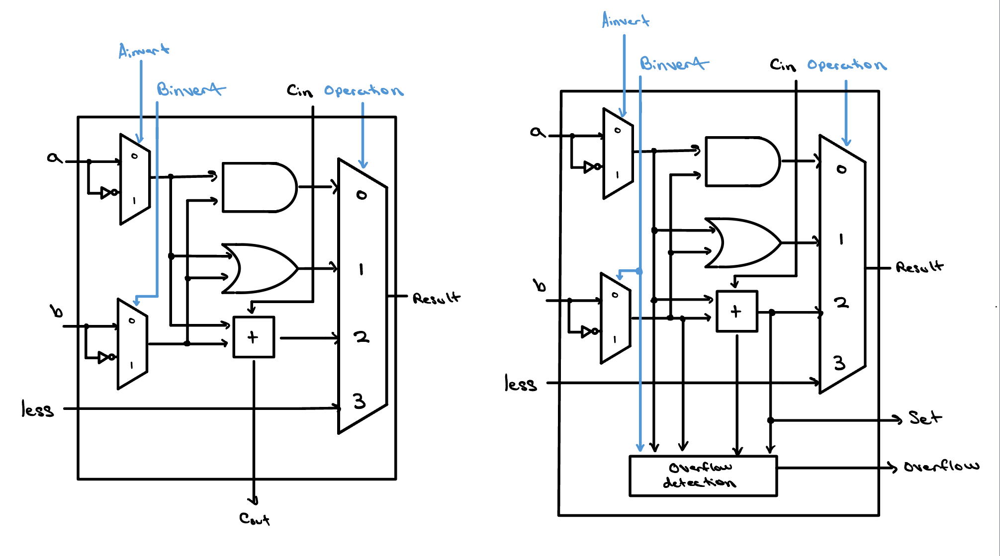
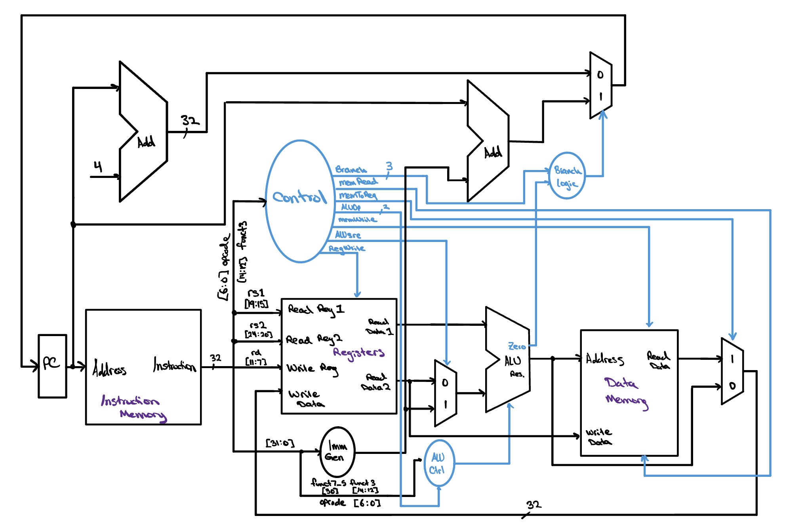
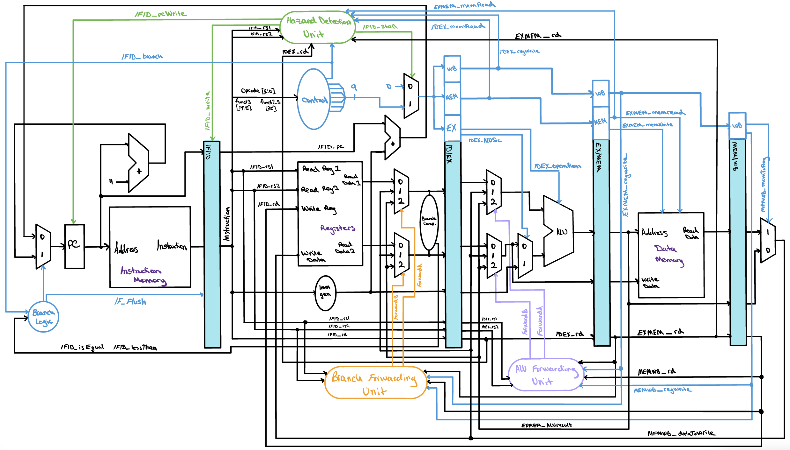

# Silicon From Scratch

> An open, hands-on way to learn how processors are *actually* built — from a single logic gate to a verified, synthesized, five-stage RISC-V pipeline.

---

<em>You don't learn to ride a bike by reading about it; you strap on your helmet and push off, finding your balance as you go, with hope that your leap into the unknown will take you to somewhere you couldn't have reached standing still.</em>

---

## What This Is

**Silicon From Scratch** teaches how the processors inside modern devices are designed, verified, and built — for people who would rather build one than read about one.

Most material on computer architecture asks you to accept a block diagram and move on. This does the opposite. Every design here is real Verilog you can clone, simulate, and take apart; every claim about it has a testbench behind it; and every performance number was measured rather than estimated. Where a diagram would normally be the end of the explanation, here it is the thing you go and build.

The whole approach rests on one idea: **dive in.** You do not need a degree, an expensive software licence, or anyone's permission. Every core design in this repository simulates on your own machine with free, open-source tools, and the written material assumes you are seeing this for the first time.

## Two Halves, Meant To Be Used Together

Silicon From Scratch is a teaching site and a hardware repository, and they do different jobs.

### The site — [siliconfromscratch.com](https://siliconfromscratch.com)

A structured course that builds the ideas up one layer at a time, with the parts that are hard to picture made interactive rather than described:

- **An interactive ALU datapath explorer.** Pick an operation, or flip the four `control[3:0]` bits yourself, and the exact gates and wires carrying the result light up while everything inactive dims. The most direct way to see *why* a mux-based ALU works.
- **Meet the Processor.** A guided descent into a real AMD Ryzen 5 9600X die in seven stops, from the packaged chip down through the floorplan, a single core, the copper metal stack, the standard-cell rows, and finally one inverter. The blocks are labelled from real die annotations, and several open onto explainer videos.
- **Editable Verilog flip cards.** Write RTL in the page and watch the truth table it produces update as you type.
- **Waveforms and Check Yourself quizzes** in every lesson, so you find out whether the idea landed before you build on top of it.

**Published lessons:**

| Track | Lessons |
|---|---|
| **Beginner — ALU** | Logic Gates and the 1-bit ALU · Full Adder and Ripple Carry Adder · 32-bit ALU Slice · Complete 32-bit ALU · Testing Your ALU |
| **Intermediate — Single-Cycle CPU** | The Basics of Instructions · Fetch, Decode, Execute · Constructing a Datapath · The Control Unit · Testing Your Single-Cycle CPU |
| **Advanced — Pipelined CPU** | Pipelining · The Pipelined Datapath |
| **Advanced — Physical Design** | Transistor Basics · Implementing Arbitrary Logic and Stick Diagrams |

### This repository — the designs themselves

The working hardware the lessons are teaching you to build. Clone it, run it, break it, and read the verification that proves it works.

**Use the site to understand an idea; use the repo to build the thing.**

## Who It's For

Students, hobbyists, career-switchers, tinkerers, and the merely curious — young or old. If you have ever wondered how a sliver of sand ends up running your code, this is for you. No prior chip-design experience is assumed, and the projects are ordered so that each one needs only what came before it.

## Start Here

Work through these top to bottom.

| Project | Level | Status | What you'll build and learn |
|---------|-------|--------|-----------------------------|
| [**ALU**](./ALU/) | Beginner — start here | Complete | A parameterized N-bit ripple-carry ALU (slice + MSB) supporting AND, OR, ADD, SUB, SLT, NOR and NAND. The single best place to understand how arithmetic and logic are actually done in hardware. Verified against a behavioral oracle. |
| [**Single-Cycle CPU**](./single-cycle-cpu/) | Intermediate | Complete | A full RV32I single-cycle Harvard processor — datapath, control, register file and memory working together to run real RISC-V programs. Verified against a lockstep golden model *and* a hand-derived final-state oracle. |
| [**Pipelined CPU**](./pipelined-cpu/) | Advanced | Complete | A five-stage RV32I pipeline with full forwarding, load-use and branch interlocks, and branch resolution in ID. The leap from "it works" to "it works *fast*". Verified against three independent oracles. |

<table>
  <tr>
    <td width="33.33%" valign="top" align="center">
      
       <b>ALU</b> One bit slice of the ripple-carry ALU
    </td>
    <td width="33.33%" valign="top" align="center">
      
       <b>Single-Cycle CPU</b> One instruction per clock, start to finish
    </td>
    <td width="33.33%" valign="top" align="center">
      
       <b>Pipelined CPU</b> Five stages in flight at once, with forwarding and interlocks
    </td>
  </tr>
</table>

Each design ships a written **design verification report** ([single-cycle](./single-cycle-cpu/docs/design-verification-report.pdf), [pipelined](./pipelined-cpu/docs/design-verification-report.pdf)) covering methodology, a per-instruction execution trace, a functional coverage matrix, and the open issues. Those reports are the part of the flow that most learning material skips, and they are where "I think it works" becomes "here is why it works".

## What You'll Find in Each Project

Every design is meant to be opened up and understood, not just run:

- **RTL** — synthesizable Verilog/SystemVerilog for the datapath, control unit, register file, ALU and memory subsystem. The design itself.
- **Testbenches** — self-checking verification environments, including lockstep comparison against an independent reference simulator and hand-derived final-state oracles. This is how you *prove* a design is correct instead of hoping.
- **Waveforms** — VCD dumps and traces that let you watch the design behave cycle by cycle. Where the abstract becomes concrete.
- **Programs** — RISC-V machine-code test programs exercising arithmetic, logic, memory and control flow. What the CPU actually runs.
- **Design verification reports** — the full written argument for correctness, per CPU.

## The Two CPUs, Compared

This is the most interesting thing in the repository, and it is the reason both CPUs exist rather than just the faster one.

The two processors implement the same instruction subset and run the **same program image, byte for byte** — one generator writes both copies, so they cannot drift apart. Both were synthesized to Nangate45 45 nm standard cells with yosys, with abc measuring the longest register-to-register path against an identical driver and load. The memories are blackboxed, and their access time is the only estimated input.

|  | Single-cycle | Pipelined |
|---|---|---|
| Clock period | 3473 ps | **1813 ps** |
| Maximum frequency | 288 MHz | **552 MHz** |
| Cell area | 10651 µm² | 14153 µm² (+33%) |
| Cycles for the program | 34 | 48 |
| **Runtime** | 118.1 ns | **87.0 ns** |

A pipeline does not execute fewer instructions, and on a short program it does not even execute them in fewer cycles — it takes 14 more. It executes them in *shorter* cycles, and it has to win by enough on the clock to pay for the cycles it added. How much it needs is arithmetic: 48 / 34, or **1.41x**. It got **1.92x**, so the same program finishes **1.36x faster** for a third more silicon.

The margin comes from where the memories sit. The single-cycle critical path crosses **both** memories inside one clock; no pipeline stage crosses more than one.

Both architectural end states are identical, register for register and memory word for memory word. That is exactly the property pipelining has to preserve, and the pipelined testbench checks it against the single-cycle design's expected-state table unchanged.

The synthesis and timing flow lives in `sta/`, and each verification report documents what it does and does not model.

## Tools

The core RTL projects run on **free, open-source tools** — no licences, no cost:

- **Icarus Verilog** — RTL simulation
- **GTKWave / EPWave** — waveform inspection
- **yosys + abc**, with the Nangate45 library — synthesis and critical-path measurement

The physical-design track uses the **Cadence suite** (Virtuoso, Spectre) for analog/mixed-signal work and full-custom layout. That is the professional toolchain, and it is useful to know it exists — but you need none of it to start, and none of it to learn the fundamentals.

## Roadmap

Actively growing. Planned:

- **More interactive lessons** on the site, including the pipelined control unit, data hazards and control hazards.
- **Physical design** — schematic capture, layout and full-custom flows in Cadence.
- **Transistor-level simulation** — verifying timing and behavior below the RTL abstraction.
- **Clock-aware static timing** — the current flow measures the longest logic path. Wire delay, clock skew, and the half-cycle write-back path created by the pipelined register file's negative-edge write all need a real STA tool.
- **A longer test program** — enough instructions to exercise the upper register file, the data memory boundaries, and forwarding priority between EX/MEM and MEM/WB.

## Contributing & Collaborating

This started as one person's exploration, and the goal is for it to be useful to others. If something is confusing, if you find a bug, or if you can explain a piece of it better, issues and contributions are welcome. A lesson that reads clearly to someone new is worth as much here as a fix to the RTL.

## About

I built these designs to deepen my own understanding of computer architecture and the full digital design flow, from a line of Verilog to a physical layout. Along the way it became clear the material could help anyone else curious about the field, which is what the site is for.

*Recruiters and collaborators: this doubles as a portfolio of that work — the verification reports and the timing comparison above are the best places to start.*
