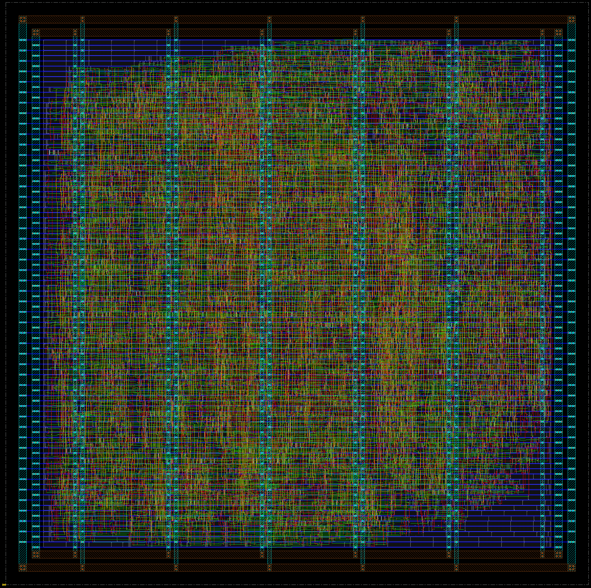
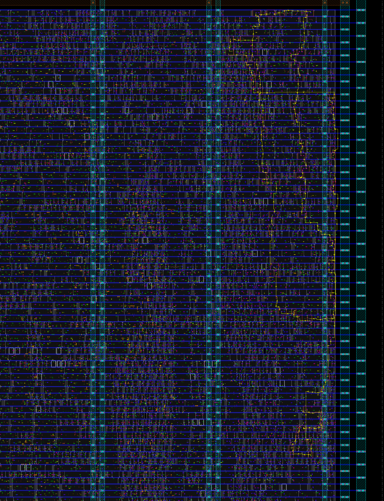
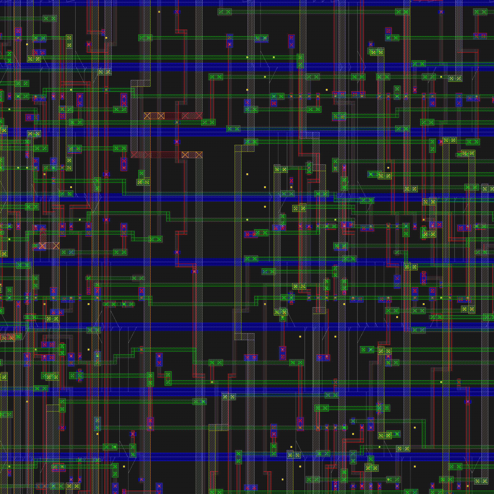

# Pipelined RISC-V CPU — Physical Design

A five-stage pipelined RV32I core taken from RTL to a routed, DRC-clean,
formally verified layout on the Nangate 45 nm open cell library, using Cadence
Genus and Innovus.

The RTL for the CPU itself lives in the main repository. This folder is the
physical implementation: the synthesis and place-and-route flow, the
constraints, the testbench that runs a program on the routed netlist, and the
reports for the design that shipped.

---

## Result

**4.00 ns, 250 MHz**, closing at the slow corner with hold clean at the fast one.

| | |
|---|---|
| Clock period | 4.00 ns (250 MHz) |
| Signoff corner | SS, 0.95 V, 125 °C |
| Setup WNS | **+0.014 ns**, 0 violations |
| Hold WNS | **+0.026 ns**, 0 violations |
| Standard cells | 5,319 (1,347 flops) |
| Core area | 18,448 µm², 73.9 % density |
| Total wirelength | 86,521 µm |
| Utilisation target | 0.71 |

Across all three corners, from one routed database:

| Corner | Setup WNS | Setup violations | Hold WNS | Hold violations |
|---|---|---|---|---|
| Slow (SS 0.95 V 125 °C) | +0.014 | 0 | +0.211 | 0 |
| Typical | +2.229 | 0 | +0.056 | 0 |
| Fast (FF 1.25 V −40 °C) | +2.401 | 0 | +0.026 | 0 |

**Every frequency here is qualified by its corner and its derate.** A
typical-corner number for this design is roughly 2.2 ns of slack better and
means something completely different.

Analysis runs in `onChipVariation` mode with derates at 1.0. The same netlist
re-judged with **5% OCV derates gives −0.237 ns**, a cost of 251 ps, which is
measured rather than estimated:

| Derate | Setup WNS | Launch clock latency | Capture clock latency |
|---|---|---|---|
| 1.0 (as shipped) | **+0.014** | 0.031 | 0.066 |
| ±5% | −0.237 | 0.060 | 0.034 |

Roughly 220 ps of that is the data path slowing by 5%; the rest is the clock
skew reversing sign, because OCV derates the launch clock late and the capture
clock early. Recovering it is a target-slack problem rather than a clock-period
one, which is what the optimisation-margin work in the project history explores.

`IO_DELAY` is set to 0.30 × the clock period, which is an assumption rather than
a measurement and is stated wherever a number is quoted.

**A restored database does not reproduce the run's derate state.**
`restoreDesign` initialises derates to the analysis mode's ±5% default rather
than to the 1.0 the run used, so re-opening this design and re-timing it reports
−0.237 until `set_timing_derate -early 1.0 -late 1.0` is issued. Worth knowing
before concluding a signed-off design misses by 251 ps.

## Verification

| Check | Result |
|---|---|
| DRC | **Clean** — `verify_drc` reports no violations |
| Connectivity | **Clean** — `verify_connectivity -error 0 -geom_connect` |
| Logic equivalence | **1,515 key points equivalent** against the RTL, Conformal LEC |
| Gate-level simulation | **PASS, 0 errors** at zero delay, typ, slow and fast |
| Repeatability | **4 of 4** closures at this configuration, mean +5 ps, σ 6 ps |

LEC reports two unmapped key points, `IF_pc_reg[0]` and `IFID_pc_reg[0]`. Both
are PC bit 0, which is constant zero on word-aligned fetches, so synthesis
removes them. Nothing else is unmapped.

**What gate-level simulation proves here, stated precisely:** the routed netlist
executes the test program and reproduces every architectural register write.
It does *not* prove the absence of timing violations. The Nangate cell models
only enforce `$setuphold` when `TETRAMAX` is undefined, and `TETRAMAX` is
required for these models to handle asynchronous reset correctly, so the
conditioned timing checks are inactive. Setup and hold come from static timing
analysis, above.

## What is not done, and why

Stated rather than omitted, because each has a specific cause:

- **Antenna checking** is not possible. The Nangate 45 LEF carries no
  `ANTENNAGATEAREA` or `ANTENNADIFFAREA` properties, so there is nothing to
  check a ratio against.
- **LVS and signoff DRC** are not possible. Pegasus is not available in this
  environment; `verify_drc` above is the router's own checker.
- **Signoff STA in an independent tool** is not possible. Tempus is not
  available, so Innovus serves as its own signoff timer.
- **Hold coverage** cannot be enumerated. `report_analysis_coverage` on Innovus
  23.12 accepts neither `-check_type hold` nor `-early`. Hold *results* are
  verified directly and are in the reports.
- **Recovery and removal checks are waived**, by `set_false_path` from the reset
  port. See `constraints/pipelined_cpu_core.sdc` for the full reasoning and the
  cost, which is 1,349 untested recovery checks. A reset synchroniser that
  closes them was built and evaluated, and it broke gate-level simulation from
  the first instruction of the program; the design ships with the waiver rather
  than with a reset network that cannot be simulated.
- **IR drop analysis** with Voltus has not been run.
- **DFT and scan insertion** are not implemented.

## The layout



The full die is 156.0 × 156.0 µm; the core where cells sit is 135.9 × 135.8 µm,
97 standard cell rows of 1.4 µm each. The 10 µm border holds the power ring on
metal8 and metal9 and nothing else. Five vertical stripes carry power into the
core, and the blue horizontal lines are the metal1 VDD/VSS rails, one per row.

Density is 73.9%, so about a quarter of the core is filler. It is not evenly
spread: measured from the DEF, the upper-left region is 70% filler against 49%
in the band right of centre, which is visible above as the areas where the blue
power rails show through with little routing stacked on them. That is the placer
minimising wirelength — connected logic clusters, and the slack collects
furthest from the netlist's centre of gravity. Route overflow is 0.00% in both
directions, so nothing was starved by it.



The worst setup path, +0.014 ns, highlighted in yellow. It launches from
`IFID_instr_reg[5]`, passes through the immediate generator, and then walks the
carry chain of `pc_plus_imm` — the 32-bit ripple-carry adder that computes the
branch target — before arriving at `IF_pc_reg[31]`. Sixty of its seventy-three
instances are that carry chain.

The shape in the picture is the structure of the adder. A ripple carry is
linear, bit 0 feeding bit 1 feeding bit 2, so the placer lays it out as a line:
`pc_plus_imm` occupies a column 18 µm wide spanning 95 µm of the core's height,
hard against the right edge. The critical path is that column.



A 10 µm window into the cell rows. Blue horizontals are the metal1 power rails
bounding each row, red verticals and green horizontals are signal routing on the
layers above, and the small crossed squares are vias.

## Running the flow

Tools are not on `PATH` by default:

```sh
export PATH=/apps/cadencedigital/r23/bin:$PATH
```

Then, from this directory:

```sh
./run.sh --period 4.0 --util 0.71 --target-slack 0.06 --artifacts \
         --name confirm-clk4p0-u71-ts06
```

That is the exact configuration of the shipped design. It runs synthesis through
detailed routing and reports all three corners from a single routed database.

Other entry points:

```sh
./run.sh sim                          # run the program on the RTL
./run.sh gls <run> [zero|typ|slow|fast]   # run it on the routed netlist
./run.sh lec <run> [syn|routed|gate]  # formal equivalence against the RTL
./run.sh --name <run> --from report   # re-report a routed run without re-routing
./run.sh libs                         # fetch the slow/typ/fast libraries
./run.sh cells                        # fetch the Verilog cell models
```

`--target-slack` tells the optimiser to stop at a positive slack target rather
than at zero. It is the knob that made this design close repeatably; margin
added to clock uncertainty instead would move the optimiser's target and the
signoff requirement by the same amount and buy nothing.

## Layout

```
rtl/            the CPU, as synthesised
constraints/    the SDC
scripts/        genus.tcl, innovus.tcl, and the QOR/report helpers
sim/            testbench and memory model for RTL and gate-level runs
programs/       the test program
results/        the shipped design's reports, committed as evidence
docs/           report and layout images
run.sh          the flow
```

`runs/` is where the tools write and is not committed. Every run is reproducible
from the scripts, and the saved databases are hundreds of megabytes of binary.
The small text reports are copied into `results/` instead, because a number
whose report is not in the repository is a number nobody can check.
