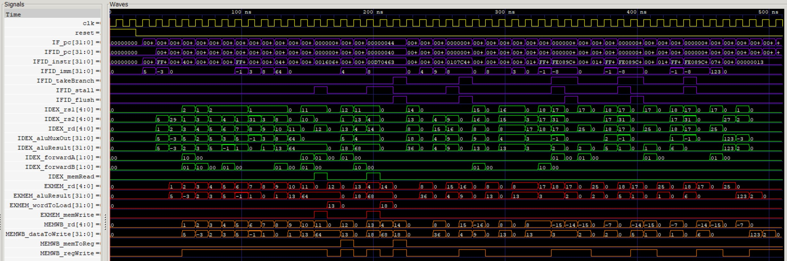

# Pipelined RISC-V CPU

A five-stage pipelined RV32I processor implemented in Verilog. It runs the same 30-instruction program as the [single-cycle design](../single-cycle-cpu/), retiring 34 instructions in 48 clock cycles with full forwarding, hazard interlocks and branch flushing. Because the two designs execute an identical program image, their architectural results can be compared directly — and their clock periods measured against each other.

---

## Architecture

Five stages — **IF, ID, EX, MEM, WB** — separated by four pipeline registers. The design keeps the **Harvard architecture** of the single-cycle CPU, with separate instruction and data memories, and adds the three units a pipeline needs: one hazard detection unit and two independent forwarding units.

### System Architecture Diagram


The four pipeline registers are the tall teal bars. The hazard detection unit is green, the branch forwarding unit orange, and the ALU forwarding unit violet. Every signal is named for the pipeline register it emerged from, so its prefix says which stage it lives in:

| Prefix | Meaning |
|--------|---------|
| `IF_` | before the IF/ID register (fetch) |
| `IFID_` | out of the IF/ID register (decode) |
| `IDEX_` | out of the ID/EX register (execute) |
| `EXMEM_` | out of the EX/MEM register (memory) |
| `MEMWB_` | out of the MEM/WB register (write-back) |

### Stages

| Stage | What happens in it |
|-------|--------------------|
| **IF** | Program counter, the PC + 4 adder, instruction memory read |
| **ID** | Decode, immediate generation, register file read, branch comparison, branch target adder, hazard detection |
| **EX** | Operand forwarding muxes, ALU source mux, 32-bit ALU |
| **MEM** | Data memory read and write |
| **WB** | Write-back mux, register file write on the negative clock edge |

### Supported Instructions

| Format | Instructions |
|--------|-------------|
| R-type | `add`, `sub`, `and`, `or`, `slt` |
| I-type | `addi`, `andi`, `ori`, `slti`, `lw` |
| S-type | `sw` |
| SB-type | `beq`, `bne`, `blt` |

---

## Module Hierarchy

```
pipelined_cpu_top_level
├── pipelined_cpu_control   Main control unit (combinational, decodes the ALU op)
├── hzrd_detection_unit     Load-use and branch-operand stall detection
├── alu_fwd_unit            EX-stage operand forwarding (from EX/MEM, MEM/WB)
├── branch_fwd_unit         ID-stage operand forwarding into the comparator
└── pipelined_cpu_datapath
    ├── instruct_mem        Read-only instruction memory (loaded from program.mem)
    ├── ripple_carry_adder  PC + 4 adder (IF); PC + immediate adder (ID) (×2)
    ├── imm_gen             Immediate generator (I, S, SB, U, UJ formats)
    ├── reg_file            32x32-bit register file, negative-edge write
    ├── branch_comp         Equality and signed less-than, with forwarding muxes
    ├── mux_2x1             Branch/increment mux; ALU source mux; write-back mux (×3)
    ├── mux_4x1             ALU operand A and operand B forwarding muxes (×2)
    ├── alu_full            32-bit ALU (ripple-carry, parameterized)
    │   ├── alu_slice       1-bit ALU slice (bits [30:0])
    │   │   ├── mux_2x1     Operand invert select, a and b (×2)
    │   │   ├── mux_4x1     Operation select (and, or, add/sub, less)
    │   │   └── full_adder  1-bit full adder
    │   └── alu_msb         MSB ALU slice (overflow detection, setLess)
    │       ├── mux_2x1     Operand invert select, a and b (×2)
    │       ├── mux_4x1     Operation select (and, or, add/sub, less)
    │       └── full_adder  1-bit full adder (MSB, feeds overflow logic)
    └── data_mem            Clocked data memory (word-aligned, read/write enable)
```

The hazard and forwarding units live at the top level rather than inside the datapath, so the datapath has exactly one source for every control signal it consumes.

---

## Key Design Decisions

**Branches resolve in ID, not EX.** A taken branch therefore squashes exactly one wrongly fetched instruction instead of two, and only the IF/ID register ever needs clearing — `IDEX_flush` and `EXMEM_flush` are tied low, because nothing wrongly issued gets past ID. The cost is that a branch needs its comparison operands one stage earlier than an ordinary instruction, which is why the hazard unit stalls on a producer still in EX.

**The flush is qualified by the stall.** `IFID_flush = IFID_takeBranch && !IFID_stall`. While the hazard unit is stalling a branch waiting on an operand, the take-branch decision is computed from data that is not ready yet, and inside the IF/ID register the flush path is tested before the write path. An unqualified flush would clear IF/ID on a stall cycle and destroy the branch instruction itself.

**No separate ALU control unit.** The main control unit decodes the 4-bit ALU operation directly from `opcode`, `funct3` and `funct7[5]`. This narrows the ID/EX pipeline register: only the operation is carried forward, rather than an ALUOp field plus the `funct` fields it would have to be combined with a stage later.

**The register file writes on the negative clock edge.** A value written in WB is therefore readable by an ID read in the same cycle, which removes the WB-to-ID hazard entirely. The single-cycle design writes on the positive edge; this is one of the few RTL changes between them that is not additive.

**Two forwarding units, not one.** `alu_fwd_unit` feeds the ALU in EX; `branch_fwd_unit` feeds the comparator in ID. Both use the same select encoding — `00` register file, `01` MEM/WB write-back value, `10` EX/MEM ALU result — and both give EX/MEM priority, since it holds the more recent result. Writes to `x0` are ignored by both.

**The two units are coupled, deliberately.** `branch_fwd_unit` forwards from EX/MEM without qualifying on `memRead`, which would be a bug on its own: `EXMEM_aluResult` holds a load's *address*, not its data. It is safe only because the hazard unit stalls that exact case before it can reach the comparator.

**Multi-cycle stalls emerge from single-cycle detections.** A load immediately before a branch stalls twice: once from the ID/EX condition, then again from the EX/MEM condition as the load advances. There is no counter and no state machine. The test program exercises this at retirements 16 and 17.

**`make lint` fails the build on an implicit net.** Verilog silently creates a one-bit wire for any undeclared identifier, so a mistyped signal name compiles, simulates, and quietly discards every bit above bit 0 of a 32-bit bus. `iverilog` reports this as a warning and still exits 0, so the recipe promotes it to a failure by hand. Run it before every commit.

**`dbg_*` observability outputs.** The top level exposes `dbg_pc`, `dbg_wb_addr`, `dbg_wb_data` and `dbg_wb_enable`. They have no functional role and the testbench does not read them. They exist because a module whose only ports are `clk` and `reset` has no primary outputs, so every net is unreachable and synthesis dead-code elimination deletes the entire CPU.

**`IMEM_WORDS` and `DMEM_WORDS` are parameters.** They default to 256, which is what simulation uses. The timing flow overrides them to 32 so the memories do not synthesize into thousands of flip-flops that bury the CPU logic in the report.

---

## File Structure

```
pipelined-cpu/
├── Makefile
├── README.md
├── rtl/
│   ├── pipelined_cpu_top_level.v   Top level: datapath, control, hazard, forwarding
│   ├── pipelined_cpu_datapath.v    Five stages and the four pipeline registers
│   ├── pipelined_cpu_control.v     Main control unit (ALU operation decoded here)
│   ├── hzrd_detection_unit.v       Stall generation
│   ├── alu_fwd_unit.v              EX-stage forwarding
│   ├── branch_fwd_unit.v           ID-stage forwarding
│   ├── branch_comp.v               ID-stage branch comparator
│   ├── alu_full.v                  32-bit parameterized ALU
│   ├── alu_msb.v                   MSB ALU slice (overflow, setLess)
│   ├── alu_slice.v                 1-bit ALU slice
│   ├── full_adder.v                1-bit full adder
│   ├── ripple_carry_adder.v        N-bit ripple carry adder
│   ├── reg_file.v                  32x32-bit register file (negedge write)
│   ├── imm_gen.v                   Immediate generator
│   ├── instruct_mem.v              Read-only instruction memory
│   ├── data_mem.v                  Clocked data memory
│   ├── mux_2x1.v                   2x1 multiplexer
│   └── mux_4x1.v                   4x1 multiplexer
├── testbench/
│   └── tb_pipelined_cpu_top_level.v   Three-oracle self-checking testbench
├── programs/
│   ├── build_program.py            Generates BOTH designs' program images
│   ├── program.mem                 30-instruction RV32I test program (hex)
│   └── program_mem.txt             Same program, annotated with disassembly
├── waveforms/
│   ├── dump.vcd                    Simulation waveform dump
│   └── waveform.jpg                Simulation waveform screenshot
└── docs/
    ├── pipelined-cpu-architecture.jpg   Hand-drawn system architecture diagram
    └── design-verification-report        Full verification report (.docx and .pdf)
```

---

## Test Program

The program is shared byte for byte with the single-cycle design, so both are verified on identical work. `programs/build_program.py` holds the instruction list in source form and writes the same image into both directories — **edit the generator, not `program.mem`.**

Roughly half of it exists for this design rather than for the single-cycle one. Three sequences force hazards a single-cycle CPU cannot have:

| Instructions | Hazard forced |
|--------------|---------------|
| `lw x12, 0(x11)` then `add x13, x12, x1` | Load-use. The loaded word is not ready until the end of MEM, so it cannot be forwarded to the ALU in time. One stall. |
| `lw x14, 4(x11)` then `beq x14, x13, 8` | Load into a branch. Two stalls: one from the ID/EX condition, one from the EX/MEM condition as the load advances. |
| `addi x17, x17, -1` then `bne x17, x0, -8` | ALU result into a branch, three times round the loop. One stall each. |

The two `addi x1/x2, x0, 99` instructions are never retired. In the single-cycle design the taken branch simply skips them; here they are fetched, enter IF/ID, and are cleared out of it by the flush before they can decode. They target `x1` and `x2` deliberately, so a broken flush is caught twice — once by the retirement-order oracle at the branch, and again by the end-of-program table.

---

## Verification

The testbench is self-checking and uses **three independent oracles**. It is not the single-cycle testbench with a new DUT name, and it could not be: that one assumes one instruction commits per clock edge and that the fetch PC belongs to the instruction committing. Neither holds here.

**Shadow pipeline.** Four registers carrying a PC and a valid bit alongside the DUT's own pipeline registers, clocked by exactly the same enable and clear conditions the RTL uses. This is what answers the question a pipeline testbench has to ask and a single-cycle one does not: *which instruction is committing this cycle?* The valid bit is cleared, not merely left stale, on a flush or a stall, so a bubble is never mistaken for an instruction — and cleared for any fetch past the end of the program, because `instruct_mem` returns a real NOP for unloaded words that would otherwise look like instructions retiring.

**Oracle 1 — lockstep golden model.** A behavioral RV32I simulator stepped once per *retirement* rather than once per clock. After every retirement the full register file and full data memory are compared against the DUT.

**Oracle 2 — retirement order.** The PC leaving MEM/WB is compared against the PC the model just executed. A missing branch flush shows up here on the very first taken branch, as the instruction behind it retiring when the model has already moved to the target.

**Oracle 3 — final-state table.** A hand-derived table of expected end-of-program state, checked once at completion. It is **unchanged from the single-cycle testbench**, which is the point: pipelining must not change the architectural result, so both designs are held to one identical expectation.

**Drain check.** After the halt the testbench snapshots architectural state, clocks eight more cycles, and compares. A single-cycle CPU cannot fail this way; a pipeline can, if an instruction that should have been squashed is still in flight when the program ends.

### Results

```
--- Pipeline behaviour ---
  instructions retired : 34
  clock cycles to halt : 48
  stall cycles         : 7
  IF/ID flushes        : 4
  cycles per retire    : 1.41

 RESULT: PASS - 0 errors. DUT == reference == oracle.
```

The 14 cycles that retired nothing account for exactly:

| Cycles | Event |
|--------|-------|
| 3 | Pipeline fill — the first instruction is fetched in cycle 1 and retires in cycle 4 |
| 1 | Load-use stall |
| 2 | Load-then-branch stall |
| 4 | ALU-result-then-branch stalls |
| 4 | Branch flushes, one per taken branch |
| **48** | **34 retirements + 3 + 7 stalls + 4 flushes** |

Not-taken branches cost nothing, so the loop exit pays a stall but no flush.

The full report, including the per-instruction trace, the coverage matrix and the timing comparison, is in [`docs/`](docs/).

### Running the Simulation

From the `pipelined-cpu/` root:

```bash
make        # compile only
make run    # compile and run
make lint   # elaborate and FAIL on any implicit net
```

> Requires `make`. On Windows: `winget install GnuWin32.Make`

Manual compile:

```bash
iverilog -g2012 -o sim \
  testbench/tb_pipelined_cpu_top_level.v \
  rtl/pipelined_cpu_top_level.v \
  rtl/pipelined_cpu_datapath.v \
  rtl/pipelined_cpu_control.v \
  rtl/hzrd_detection_unit.v \
  rtl/alu_fwd_unit.v \
  rtl/branch_fwd_unit.v \
  rtl/branch_comp.v \
  rtl/alu_full.v \
  rtl/alu_msb.v \
  rtl/alu_slice.v \
  rtl/full_adder.v \
  rtl/ripple_carry_adder.v \
  rtl/reg_file.v \
  rtl/imm_gen.v \
  rtl/instruct_mem.v \
  rtl/data_mem.v \
  rtl/mux_2x1.v \
  rtl/mux_4x1.v

vvp sim
```

**View waveforms**

```bash
gtkwave waveforms/dump.vcd
```

### Waveform



Every control event is visible. Each pulse on `IFID_stall` is a cycle where `IF_pc` and `IFID_pc` hold instead of advancing. Each pulse on `IFID_flush` follows `IFID_takeBranch` by one cycle and clears `IFID_instr`. The load-use stall is the one `IFID_stall` pulse that coincides with `IDEX_memRead` rather than with `IFID_takeBranch`.

---

## Timing: Was It Worth It?

The testbenches count cycles. They cannot say how long a cycle is, so both designs were synthesized to Nangate45 standard cells with yosys and their critical paths measured by abc, using an identical driver and load so the two numbers are comparable. The memories are blackboxed, and their access time is the only estimated input.

|  | Single-cycle | Pipelined |
|---|---|---|
| Logic critical path | 2173 ps | **1813 ps** |
| + instruction memory | 700 ps | in IF |
| + data memory | 600 ps | in MEM |
| Clock period | 3473 ps | **1813 ps** |
| Maximum frequency | 288 MHz | **552 MHz** |
| Cell area | 10651 µm² | 14153 µm² (+33%) |
| Cycles for the program | 34 | 48 |
| **Runtime** | 118.1 ns | **87.0 ns** |

**These are pre-layout numbers.** They come from logic synthesis alone, with no clock tree, no wire parasitics and no corner spread, so they answer *which architecture is faster* rather than *how fast this will run*. This design has since been taken through Cadence place and route in [`pipelined-cpu-physical-design/`](https://github.com/estaresinic05/Silicon-From-Scratch/tree/main/pipelined-cpu-physical-design), where it closes at **244 MHz at the slow signoff corner**, and at 358 MHz when judged at typical. The comparison here is unaffected by that, because both designs were measured the same way as each other.

The memory addition is asymmetric, and that is most of the story: the single-cycle critical path crosses **both** memories inside one clock, while no pipeline stage crosses more than one.

The pipeline needed a **1.41x** clock advantage to pay for its extra 14 cycles. It got **1.92x**, so the program finishes **1.36x faster** for a third more silicon. On a longer program the margin widens, because the three fill cycles are a fixed cost this 34-retirement program pays in full.

The flow lives in `sta/` alongside the two designs, and the report in [`docs/`](docs/) covers what it does and does not model.

---

## Tools

| Tool | Purpose |
|------|---------|
| Icarus Verilog 12.0 | RTL simulation |
| GTKWave / EPWave | Waveform inspection |
| GNU Make | Build automation and lint |
| yosys + abc, Nangate45 | Synthesis and critical-path measurement |

---

*Part of the [RISC-V CPU Design](../README.md) repository.*
